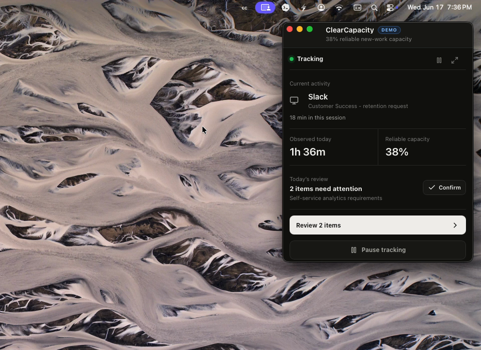

# ClearCapacity

ClearCapacity is a local-first macOS workload intelligence prototype for analysts. It turns calendar events and foreground-app activity into reviewable work blocks, then produces an explainable estimate of weekly allocation and reliable capacity for new work.

> [!IMPORTANT]
> ClearCapacity is an early prototype, not a production monitoring or workforce-management system. Capacity estimates are planning aids and should be reviewed by the user before they are shared or used for decisions.

## Why ClearCapacity

Analyst workload is often split across planned projects, recurring reporting, meetings, reactive requests, debugging, and coordination. Conventional task lists capture only part of that work. ClearCapacity explores a more complete workflow:

1. Collect limited activity metadata locally.
2. Group signals into candidate work sessions.
3. Let the user review, relabel, confirm, or exclude inferred work.
4. Convert reviewed work into an explainable weekly capacity model.
5. Generate an editable analyst or manager summary.

## Current Features

- macOS menu-bar app built with Tauri
- foreground app and window-title sampling
- local session grouping and audit history
- Outlook `.ics` calendar import
- reviewable work ledger with confidence and evidence
- Daily Review corrections and exclusions
- category, work-mode, planned-status, and project labels
- explainable weekly capacity calculation
- optional OpenAI-assisted classification, review suggestions, forecasts, and narratives
- optional screenshot-derived visual context with an explicit opt-in toggle
- browser-local persistence for prototype data

## Privacy Model

ClearCapacity is designed to keep raw activity data under the user's control:

- Active-window capture records app name, front-window title, and timestamp.
- Outlook exports are parsed locally.
- Review history, audit events, and derived work blocks are stored in local webview storage.
- Tracking can be paused immediately from the app or menu bar.
- Visual context is disabled by default.
- When visual context is enabled, a screenshot can be sent to the OpenAI API for analysis. The temporary image is deleted locally after it is read, the API request uses `store: false`, and only the derived insight is retained by the app.
- Other AI features send structured prompt context to the OpenAI API when triggered. Classification, review suggestions, and forecasts are manual; weekly narrative generation can run automatically after the app has workload evidence.

Read [Privacy and Data Flow](docs/PRIVACY.md) before enabling activity capture or AI features.

## Requirements

- macOS
- Node.js 20 or newer
- npm
- Rust toolchain for the desktop app
- an OpenAI API key for optional AI features

## Quick Start

Install JavaScript dependencies:

```bash
npm install
```

Create your local environment file:

```bash
cp .env.example .env
```

Add an OpenAI API key to `.env` if you want to use the optional AI features:

```dotenv
OPENAI_API_KEY=your-api-key
```

Run the web interface:

```bash
npm run dev
```

Open `http://127.0.0.1:5173`. Native activity capture, menu-bar behavior, and OpenAI commands require the Tauri desktop app.

## Product Demo

Launch a polished, fully populated demo without an API key or real activity data:

[](docs/assets/clear-capacity-demo.mp4?raw=1)

**[Watch the 16-second product demo (MP4)](docs/assets/clear-capacity-demo.mp4?raw=1)**

```bash
npm run demo
```

Demo mode includes realistic work blocks, active-window sessions, Outlook events, review corrections, an AI forecast, an editable weekly narrative, visual-context metadata, and a complete audit trail. It is clearly labeled, does not persist changes, and never overwrites normal local data.

See [Product Demo](docs/DEMO.md) for the three-minute presenter script and direct links to each feature view.

## Run the Desktop App

Install Rust if needed:

```bash
curl --proto '=https' --tlsv1.2 -sSf https://sh.rustup.rs | sh
```

Optional AI features read credentials from the repository's `.env` file when the desktop app starts:

```dotenv
OPENAI_API_KEY=your-api-key
OPENAI_MODEL=
OPENAI_VISION_MODEL=
```

Then run:

```bash
npm run desktop:dev
```

The desktop scripts use Apple’s standalone Command Line Tools when
`DEVELOPER_DIR` is not already set. This avoids coupling local Tauri builds to
a full Xcode installation whose license has not been accepted. Set
`DEVELOPER_DIR` explicitly to build with a specific Xcode version.

`OPENAI_MODEL` and `OPENAI_VISION_MODEL` are optional overrides. Exported shell variables still work and take precedence over `.env`. The real `.env` file is ignored by Git; only `.env.example` should be committed.

The app launches in the macOS menu bar with the main window hidden. macOS may request Accessibility or Automation permission for foreground-window metadata and Screen Recording permission if visual context is explicitly enabled.

## Available Commands

| Command | Purpose |
| --- | --- |
| `npm run dev` | Start the Vite development server |
| `npm run build` | Type-check and build the web interface |
| `npm run preview` | Preview the production web build |
| `npm run desktop:dev` | Run the Tauri desktop app in development |
| `npm run desktop:build` | Create a desktop release build |

If a native release build is constrained by available memory, reduce Cargo parallelism:

```bash
CARGO_BUILD_JOBS=2 npm run desktop:build
```

## How Capacity Is Calculated

The deterministic v1 model starts with a 100% weekly baseline and subtracts:

- recurring commitments
- carryover risk from unverified, low-confidence work
- weighted reactive load
- a fragmentation penalty
- a work-in-progress penalty

The result is clamped to 0-40%:

```text
Reliable New Work Capacity =
  clamp(
    100
    - recurring commitments
    - carryover risk
    - weighted reactive load
    - fragmentation penalty
    - WIP penalty,
    0,
    40
  )
```

This metric is not intended to represent free time. It estimates how much new planned work the following week can absorb without likely slippage.

## Project Structure

```text
apps/desktop/
  src/                       React interface and prompt builders
  src-tauri/                 Tauri shell and native macOS commands
packages/
  domain/src/                Shared workload and audit models
  inference/src/             Capacity calculation and session grouping
  integrations/src/calendar Outlook .ics parsing
```

## Validation

Run the current project checks before opening a pull request:

```bash
npm run build
npm audit --audit-level=moderate
cargo check --manifest-path apps/desktop/src-tauri/Cargo.toml
```

There is not yet an automated test suite. Adding focused tests for calendar parsing, session grouping, capacity calculations, and native command boundaries is a project priority.

## Known Limitations

- macOS is the only native platform currently supported.
- Data is stored in local webview storage rather than an encrypted application database.
- Outlook integration requires a manual `.ics` export.
- Window titles can contain sensitive information and should be reviewed or excluded.
- AI features require network access and may incur API usage costs.
- Visual context captures the current screen, not only the active app window.
- Capacity weights and thresholds are prototype heuristics, not validated organizational benchmarks.
- The main React and Rust modules are still large and need further decomposition.

## Contributing

See [CONTRIBUTING.md](CONTRIBUTING.md) for development and pull-request guidance. Please use GitHub issues for reproducible bugs, privacy concerns, and narrowly scoped feature proposals.

## License

No open-source license has been selected yet. Until a license is added, the source is publicly viewable but standard copyright restrictions still apply.
